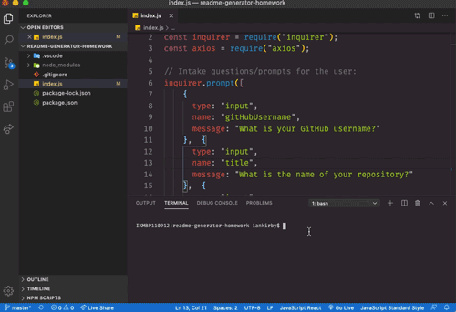

  # test response

  ## Description
  test response

  ## Table of Contents
  * [Installation](#installation)
  * [Usage](#usage)
  * [License](#license)
  * [Contributing](#contributing)
  * [Tests](#tests)
  * [Questions](#questions)
  
  
  ## Installation
  test response
  
  
  ## Usage
  test response

  

  
  ## License
  
      
  
  ## Contributing
  test response

  
  ## Tests
  test response

  
  ## Questions?
  Please feel free to reach out to me with any questions.
  
  GitHub Profile: <a href='https://github.com/vertjames'>vertjames</a>  
    
  _ _ _